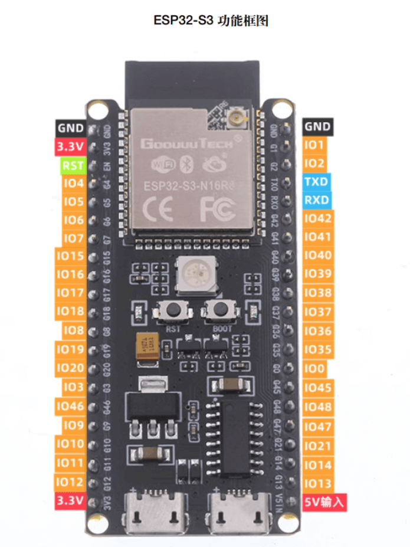
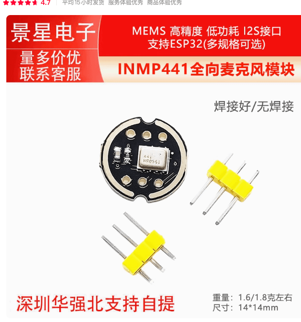
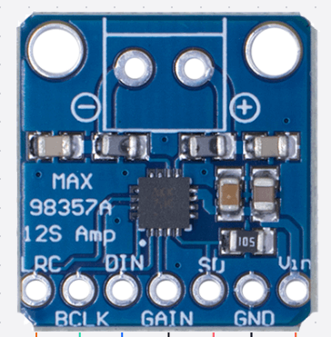
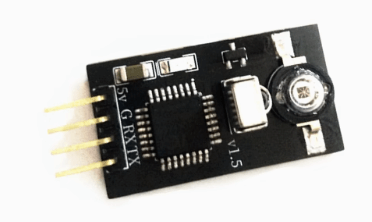
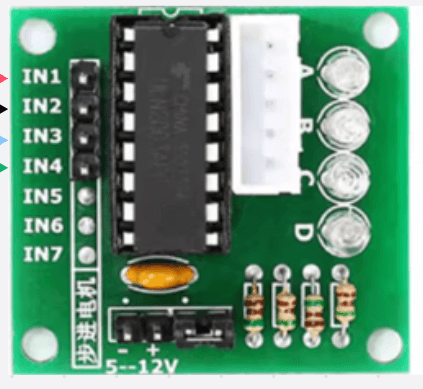
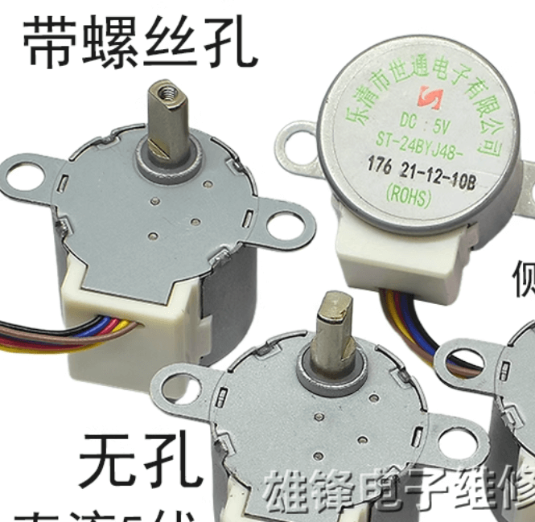
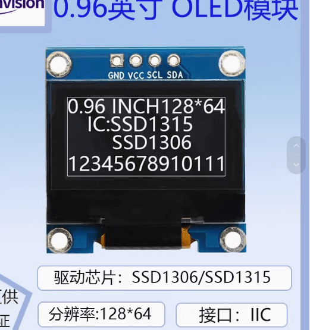
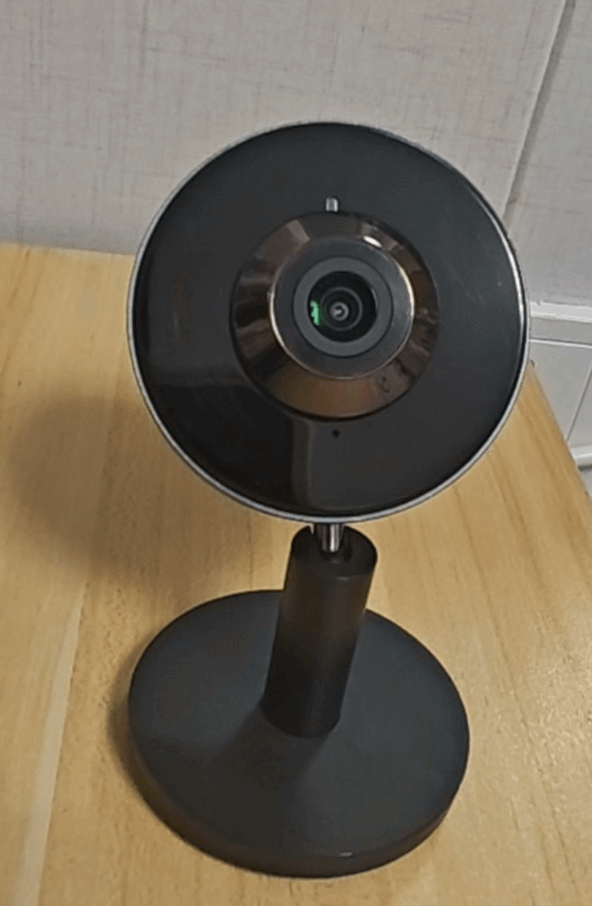
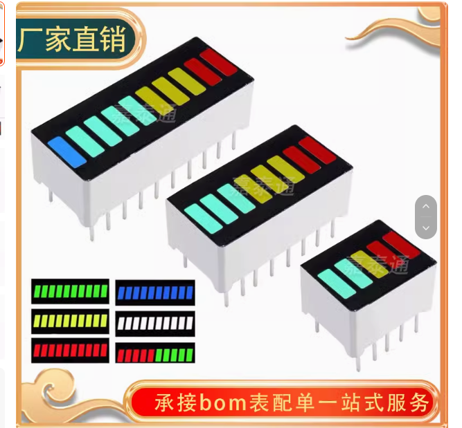
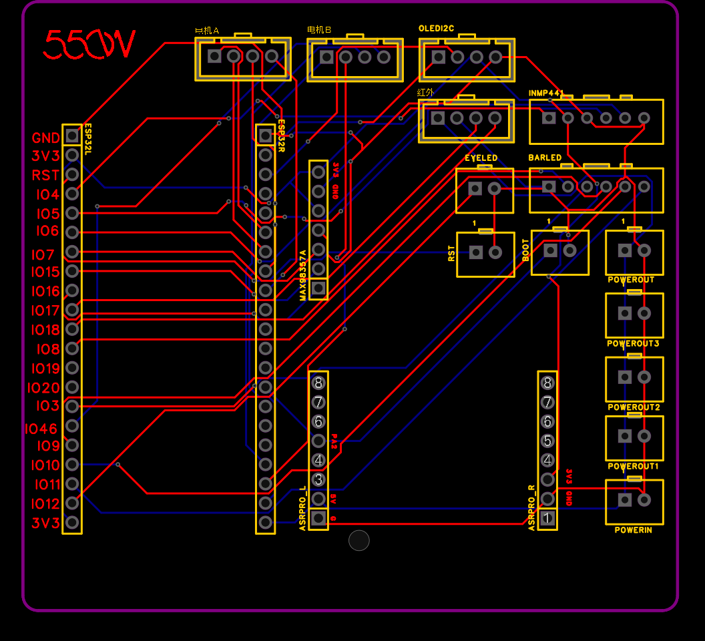

## 基于虾哥小智AI智能体的MOSS版本

- 小智教程合集：https://ccnphfhqs21z.feishu.cn/wiki/F5krwD16viZoF0kKkvDcrZNYnhb
- 小智官方仓库：https://github.com/78/xiaozhi-esp32

## MOSS材料清单

**注意！！！ 以下淘宝链接均为作者手搓时购买的店铺 非广告 非广告 非广告**

1、MOSS 3D打印外壳：小黄鱼 搜独角兽模型（他家现在也有成品在卖·有监控加小爱音响改版和小智版本（我之前买的时候他家还没有，只买了外壳））

2、ESP32 N16R8  开发板一块

[淘宝链接](https://item.taobao.com/item.htm?id=718248966902&pisk=gmy_sM9zfreFcrMvcfjedxAN6FkX1MWPHniYqopwDAHtGKEaPmJqg1mXh2ZRjV5csrNQkycZWqlqhmar-lJVjlSfhoE-WxPZ7mUUlyAa7-u48tZuPfJaD--gtzrJQR5i3KMinxQPzTWyjlDmHjmX_NTGp0mV3FHxkADpzVtNwTWzjktZXgrdU-JHV-i6MKUx62pKq2LvHqUx9pnmJdnvBmLdA20pBEHxHknKjc9vkrptpHnj2EKtDmBLvmgKkx3TkkII023x1D8I01iYfG5AUgdv2iZjRKpYdDQmql9ynDetf2g7XR_N7ims14EtRNBuQrlb5fwFCUm_9uanfrXkIAhb67HTha6spuVUWDaAPIgLNR2jaR_WZVeiozMTOwpsHAm7cbPFDQgUMk2IOR1ymD2aDRcreTYtuWr7hmwco9a7XPN-wRL14Z9rPA7DGHGkhDgPAMODiFyKsxTbv7VK6DmOUMsBRIctxDi33MO6ifnnXZsCAeOc.&spm=tbpc.boughtlist.suborder_itemtitle.1.5b0e2e8dKPT47R "淘宝链接")

3、INMP441全向麦克风：
[淘宝连接](https://item.taobao.com/item.htm?id=828386379455&pisk=g718sctGer3R89fJoaymxZvtyZ4D9-bPug7stHxodiIAvN3lEpxHdBINXpG3UQvp9itcZ3bkNe9CxG6kVTxn96IV2bcHNMVpANW483YlZ2LChghhEaxlH2dPiTcHquRdRGALjlVgsa7yaBZgjwJLOnd6P4gSxH_XGBYdnaMo5a7yTHgmARXfz2Cgbd0WRHavGeTtNBTBFIavJFKBO39IcxT6cBOBVX_fle8sA4tIOr3XJUGSAetScSTwWYOBFM_bke-XPBOI1QzJ04T-9Ovv0DGxKols1sLJeHhHoXL5gfvvfeKjOlsMyc-1PnhIOhpMnZ7CAkhH1OSA9dsg9jRlWtOXytUIh39OFgYVv5hWVsQ5N3f7mbx5aZ6GtiaIOHBfCdX1PoDvkt_lMKf_XXpPhgWwp6q0_QXGS6J1N7nwmd8dXQ6YcbI14UCG6LOojhLnFrUxLvJWujWTUraVo-16kh4WFvkeKE8vjrEsdviDuEKgPEkELpYV.&spm=tbpc.boughtlist.suborder_itemtitle.1.5b0e2e8dKPT47R "淘宝连接")

4、MAX98357A功放板一块

[淘宝链接](https://item.taobao.com/item.htm?id=836587547562&pisk=g5ua_5187rDC5-wTj2aVL-FVAhzTCrJWnqwbijc01R2MD5TcujluGCpv6DPmhvdv6PG03xkQpZNXXKQqLAGoflMjf-V0Kvc15-TT0xlSex_XWcNcuvGYmxgqMZPmixdThCKI6fUYoL9SuUGt62rf1V0NjyXn9760iHZGbel6OL9WPE-GtrJwFxOiqOt3a740sRVgtBP_wG40m5cHTSVfIibinBRUi520nr2cteV8srX0ISbht7VPoOVgikAUMJV0ix4DTy2LifFinAQULlAYI5FNmHS3t8cgLZbPwyZMBjSfqgqUsk0c4JQ0O2Pab8ciz9BgVSoozlHkdGwi4mMzNATh7YliQ0qoS9vUkXir37uMZgyqBX0_xVAf2WUxj04iuLWi9uun5PneUawovj04xfpP2WimNViqCpQ0C0lnLugCdaan7AugYzjzLtFH5e3xbtj4jWFUFBRFz4VQjxRT_qsADk-LT8OJwiIYj8_fbV3ODiEesWyWwQC..&spm=tbpc.boughtlist.suborder_itemtitle.1.5b0e2e8dKPT47R "淘宝链接")

5、红外学习及发送模块

[淘宝链接](https://item.taobao.com/item.htm?id=758119858232&pisk=gcjU_kMvY3f1VhRp-Gtr_Qpr5y-pG3PbZgOWETXkdBA3ypZo4TWDFJF8pNJlN1e8pH6ka_566097J7nP_66cRe15RQvks1XIAQZpz_WfM_i7vw9o416Jr_sPe0JlE_epNJU1p9KJqSNf4o6dpG8SdMjE-VvGBL9HEPTn8lWQCSNbcuznI3PUG_whSrUM3KxkKBvHIRJDU4xkrpXgQLvSt4mhZRywEpAkZ3AoIlvvK3cHK0xMjp9n-bYktF2weC0n-_xuQhA9Efp5Z6nw_e2JtppErle9KIXH_0mqHH8n_O3Sr4AyKFIoCCnkCGJe8IXh0fhHlL7c0eC012Ohua12h6ZiYsWhTZYcxfVw2O_VaKS3nqRP9OjBSM2SkdKR-Zxh4SlhBESGAHQagmOcWTjyS9Fqkd_lhM_PO5nkOZWG_Ess1mtGY6SH7njrzbpgAlIR8b0y-dpwGRyZ0iv6-_ypLgg-yFz9QIwYH43J-IiS8MIKy4LaKdRbH-C..&spm=tbpc.boughtlist.suborder_itemtitle.1.5b0e2e8dKPT47R "淘宝链接")

5、ULN2003步进电机驱动版2块

[淘宝链接](https://item.taobao.com/item.htm?id=39788815912&pisk=gkuusa_yP-61IF9YDqaWbDShMmKxozaI8vQLpyee0-yXOgIJNkPEtv0K2XyL-vDnK8EeFz3nnfGpN2d7zeVEBx4Kw8eKnBD-OwpWAzQFKYGwFbepN22UnYk3AQwLLJDKT0dvWFhSNyaEKdL9WmZ-wJMlaayyTtPL_IFyG08EbyaeBpjA8uTgRYoS_USP0SybtaSzLvWVgWy4TgzEL-r4_5Bz8vkU3sPQTJ7F8gPVg-NCaT7F8sz467VzTvzeirPT3JzU4vlq6fIzB2oZuK3u9eba2eMgZu2Za8l8ZqSgAgMUnIRmrmAYCbSC8wu0Zu0qf8KWAyorwxqtqdbuWbosd5kPULVmrf0nbx8Arycqb24quK5YUcGm-z3y9UzqrY0zmv5dDuosecrmkLbbQmlm9omXOgeKfWkQf2p1P8lE1ViTSef3icc4ogJh0GJXXwN29qSCAuPbiR3bgUYr7pdomIAcXXZzG5w9iIjCwO_FPRdDiGHz4SN_B&spm=tbpc.boughtlist.suborder_itemtitle.1.5b0e2e8dKPT47R "淘宝链接")

6、24BYJ48步进电机2个（1比 64 扭力大些）

[淘宝链接](https://item.taobao.com/item.htm?id=800157919463&pisk=ge14OTgpgCj51h-vn_OZ4hLZF-RvqCrQj1t6SNbMlnx0BENi_N7H5rETkT8GfgUTkI_MbGSW2fT_HlhN4i_hhKs1hhYMqgbjGhNvQG7CvGG_MtTi_g_9IG1NWf8GSGUvfre5kZd9skZC_W_Ak_JslsfwnQYkRacDoE2WZx-fuJqQOW_znEd1rk1_oJS2ueGMsKxmZUxJJcccjdclr3L9SmYiizzy2FnMjCAMr4YX-cAisCbkZeTKoEDDjYxk2FAMohjGrz86qhcMQGjxa3J0WnYvuAmEgnKho3liT2QXnWbICYkruE9kvL2m6fU9uK-ho3r09ss6QiJVNSopuTbF2EST9jdDQtXHi1rUgQbdFiYPjkkwq95A_p14YvKcMhIeiTrogCAv8NJCFPDeVObRaL54dVLRGNfvdBVKmh65818N6lFPYZjVKpfm0g8EXUVbw1BqjAJDyU-QzzlFtU9cbrLV1AH9U8LyAyUKBApDAfMVMsHtBLzDzHaLJ&spm=tbpc.boughtlist.suborder_itemtitle.1.5b0e2e8dKPT47R "淘宝链接")

7、0.96寸 OLED液晶屏幕

[淘宝链接](https://item.taobao.com/item.htm?id=807952089145&pisk=gfgT_G2oXBC9y_uTtf-hnXqR6XA3hHcZTAl5o-2GcvHKHbCijo20crHreo_DbPqYkvwnSRcg5SZjnYigCc2ckqHEBNb05xYYhboegRViSsFjAAQmjf2ivsUZ-cb0IdzxGY4vELYkrfla7r9kEjrvlJU761s1nS_CArVxxfsGNflau-1hh3mI_s3kdYCbG-OLRSNRlrZ_lMGQLSj_hxw_A9N8arajhR1IOSPflts_h6OL_S6115ZjO6NgMZsshrOKOJPbl5MblfCM6J5_6ZnuvJWfJQIM7FuL6leAoY_YBqbu18wTdZJPcWEOjfwdlZgKD72438LddJcjamZKkF7guXm-HmMBGZwxA7H8ZAYCWriIp4ESTLQaBDMZkPqyksFK2XMtSrKR_W0tO4rx7dQQBvlIqPuWLZHStb0aYqpRd-ogayNtvIsQCosze408fPXueSj69BIV0lNF80KwOBlHA4NLECZ10ir0TWek9Lsfc9VU98A_TiS4mW5..&spm=tbpc.boughtlist.suborder_itemtitle.1.5b0e2e8dKPT47R "淘宝链接")

8、ASR-PRO(可选，自定义唤醒词) 暂时没用正在研究 板内自定义唤醒词

9、支持ONVIF协议的网络监控摄像头一个（带云台的最好可省去上面购买步进电机的钱 喝咖啡）

我在咸鱼买的睿盯2K高画质摄像头

10、喇叭 （我忘了什么尺寸了，也是咸鱼买的后面补上吧）

11、5段红色 LED数码管

[淘宝链接](https://item.taobao.com/item.htm?id=859938456982&pisk=g33z9CfTzyDXOZy8qqaF3JFFc3z8GyJ6K2wQtXc3N82kv7Th8XlgOQppwmPndxdpwzG3LvkbHwNB2pQE3YGiVuMIVJV3nxc5PJT8YvlsBv_By0Nh8xGLxvgE9wPntvd8dQKjwbUL-d9s8FG-wqrCN40Uqjq09jVhxgxbogySahv65FG2q7UIidgBZ1Y8Z5_3-u2loS2YTgjhqvqcoWecrWbuttA4H-blKy4niSV8awXnKwbDo7NdKwVutEf0T-23-W2Hgj2YTy2nsLkneZy4qBeuw7SHxT6_Qb2V-w0kJj2w_SVYqqkUqRZctNbM97rzIb22EF3Sdkkz4qTPB7om_xFrpFQ8rkoojz0eQUzm6mMugvvNY-mZy2rszdSTE4eKQzm2naz3y5lUfmOhb-inMqrqzh1LM4GnylaMWT2IcfuUT2ppuAloUcqirTSzU9FDPE3K49jUqSF4CIRV7VVbqvR8a2sdvo-YgRO96MILqR_C443RvME2ZSy66CC..&spm=tbpc.boughtlist.suborder_itemtitle.1.5b0e2e8dKPT47R&skuId=5674830593305 "淘宝链接")

## 完整的引脚接线图

## 为了防止MOSS壳子内排线乱 画了个简单的底座板子(不会贴片)，如果有需要可以在立创下单打版

源文件在pcb/MOSS_PCB.zip

# 写在最后

如果接线跟上述连接一致、可以直接拉取本项目到本地 编译烧录到板子。
注意下 ESP IDF版本（5.3.2），本工程基于虾哥很早之前的版本实现的了，其他版本不保证会不会出问题

觉得有用的兄弟们 别忘了点个 star 支持下

另外搞了一个交流群（1013376651），有需要的小伙伴以及有问题可以在群里问，看到了回复

